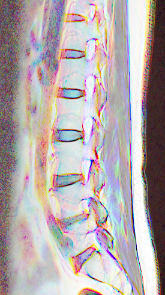
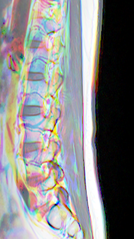
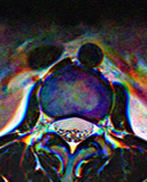

# RSNA 2024 Lumbar Spine Degenerative Classification

This repository contains my work for the [RSNA 2024 Lumbar Spine Degenerative Classification Kaggle competition](https://www.kaggle.com/competitions/rsna-2024-lumbar-spine-degenerative-classification).

## Competition Overview

The challenge focused on classifying five lumbar spine degenerative conditions:
1. Left Neural Foraminal Narrowing
2. Right Neural Foraminal Narrowing
3. Left Subarticular Stenosis
4. Right Subarticular Stenosis
5. Spinal Canal Stenosis

For each imaging study, severity scores (Normal/Mild, Moderate, or Severe) were provided for each condition across five lumbar intervertebral disc levels: L1/L2, L2/L3, L3/L4, L4/L5, and L5/S1.

## Dataset

- Patient studies included 2-5 scans each
- Scan types: Sagittal T2, Sagittal T1, Axial T2
- Images contained DICOM metadata (image orientation, slice thickness, etc.)
- Approximately 70% of scans had images labeled with coordinates by doctors

## Approaches

### 1. Multitask Model

#### Preprocessing (`Preprocessing_for_multitask_model.ipynb`)

1. Created a model to detect the most relevant image in each scan:
   - Used an ensemble of RandomForest, SVM, MLP, and XGBoost
   - Features extracted using the skimage library
2. Selected three images around the detected one
3. Cropped images around the area of interest:
   - Axial T2: Statistically determined regions
   - Sagittal: Based on scan characteristics
4. Updated known coordinates after cropping
5. Resized and saved the images

#### Model Implementation (`Multitask_model.ipynb`)

1. Defined a PyTorch dataset:
   - Loaded images
   - Stored in nested tensors (different shapes for axial and sagittal images)
   - Provided masks for missing coordinates and images
2. Created a model with:
   - Backbone: Feature extractor from timm
   - Keypoint regressor: Predicted coordinates
   - Classifier: Multiple classifiers for each condition and location
3. Training loop:
   - Inferred coordinates
   - Cropped images around coordinates
   - Applied super-resolution
   - Fed back to the model for final classification

### 2. Sequence Model

#### Preprocessing (`Preprocess_for_sequence_model.ipynb`)

1. Selected 10 evenly spaced images per scan type
2. Ordered and cropped images

#### Model Implementation

1. Used a PyTorch pretrained timm feature extractor
2. Extracted features from each image in the scan sequentially
3. Passed features to a transformer encoder to process relationships between images
4. Fed transformer output to a classifier for all conditions and levels

## Repository Structure

- `Preprocessing_for_multitask_model.ipynb`: Preprocessing for the multitask model
- `Multitask_model.ipynb`: Implementation of the multitask model
- `Preprocess_for_sequence_model.ipynb`: Preprocessing for the sequence model
- `Sequence_model.ipynb`: Implementation of the sequence model
- `converted_images/`: Folder containing preprocessed image examples
